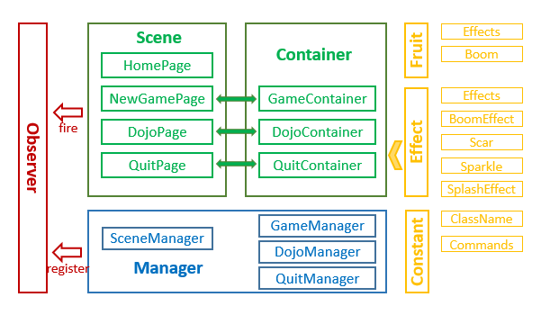

##用Egret引擎写的水果忍者游戏
在学习egret2D引擎之初，本人模仿水果忍者写了一款H5小游戏，其实就是一个小demo。
首先说明，本demo中的素材以及游戏逻辑均来自http://www.jq22.com/jquery-info487
这是一款由百度JS小组提供的HTML5版切水果游戏，这款基于HTML5实现的网页版切水果游戏虽然和原版的切水果游戏相比仍有美中不足之处，但也算有声有色，画面效果也十分炫目华丽。有兴趣的同学可以去查看。
写这篇文章是为了记录代码结构以及学习过程中遇到的问题。

###代码框架
本例用到的设计模式主要有：观察者模式和单例模式。源码主要包括四个部分，如下图所示。

第一个部分是观察者，它的作用是实现事件机制，将视图和游戏逻辑分离开。而且观察者是个单例。
第二个部分是视图，包含场景和游戏容器。游戏中涉及到四个场景，分别是：Home场景、NewGame场景、Dojo场景、Quit场景。Home场景时游戏初始场景，其它三个场景分别对应三种玩法，目前只完成一种玩法，在NewGame中。
除了Home场景外，另外三个场景分别与一个游戏容器关联。游戏容器本质是一个显示容器，用来实现各个玩法相关的显示对象以及动画效果等。场景和容器都是单例。
第三个部分是管理器，主要作用是场景管理，游戏逻辑管理。在管理器中为观察者注册需侦听的事件，在视图部分触发事件，这样实现了视图和逻辑的分离。
第四个部分是基础单元。包括水果类、特效、以及一些常数的定义。

###各个文件作用
####观察者
Observer.ts：观察者类，定义观察者
####管理器
SceneManager.ts：游戏场景管理
GameManager.ts：NewGame模式下游戏逻辑管理
DojoManager.ts：Dojo模式下游戏逻辑管理，暂未实现
QuitManager.ts：Quit模式下游戏逻辑管理，暂未实现
####场景
BaseScene.ts：场景基类
HomePage.ts：主页场景类
NewGamePage.ts：NewGame模式场景类
DojoPage.ts：Dojo模式场景类
QuitPage.ts：Quit模式场景类
####游戏容器
gameContainer.ts：NewGame游戏容器
dojoContainer.ts：Dojo游戏容器，暂未实现
quitContainer.ts：Quit游戏容器，暂未实现
####水果类
BaseFruit.ts：水果基类
apple.ts, banana.ts, basaha.ts, peach.ts, sandia.ts：各个水果类，继承自水果基类
boom.ts：炸弹，继承自水果基类，重写一些方法
####动画效果
Effects.ts：基础动画，如上下跳动、旋转
BoomEffect.ts：爆炸动画，切到炸弹时触发
Scar.ts：刀痕特效，手指在屏幕上滑动时触发 
Sparkle.ts：火花特效，模仿炸点引线点燃时溅射的火花
SplashEffect.ts：果汁溅射特效，模仿水果被切开时果汁迸溅的效果
####常数定义
ClassName.ts：定义一些类的类名
Commands.ts：定义一些命令的名称

下面附上源码地址和demo演示地址：
